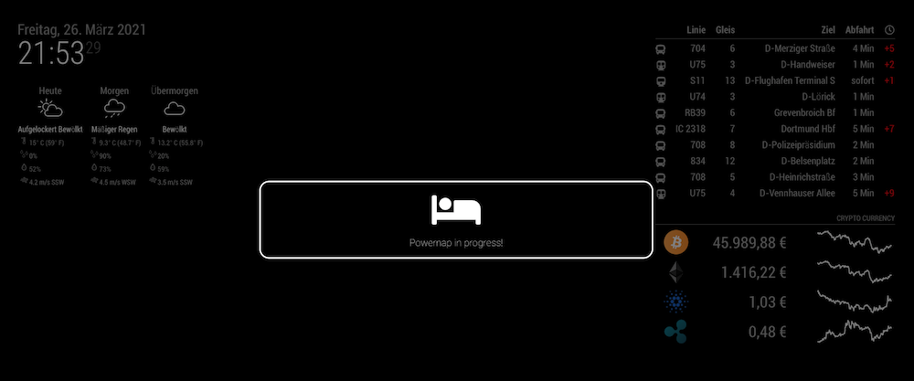
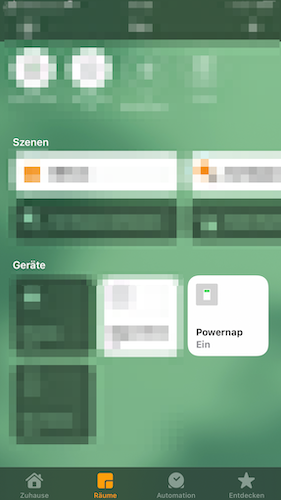

# MMM-powernap

This is a module for the [MagicMirror²](https://github.com/MichMich/MagicMirror/).

You can display a Message on the MagicMirror, if someone in the household does currently a powernap! 
For this to work, you need a working instance of the [homebridge](https://github.com/homebridge/homebridge) software with the
[cmdSwitch2](https://github.com/luisiam/homebridge-cmdswitch2) module.

The shown message is a native MagicMirror [alert](https://docs.magicmirror.builders/modules/alert.html#usage) message, which gets triggered trough a GET Request to the URL `/MMM-powernap/show` and removed with `/MMM-powernap/remove`.
The On- and Off requests are triggered trough the [cmdSwitch2](https://github.com/luisiam/homebridge-cmdswitch2) switch.

**MagicMirror**
 

**Homebridge Switch** </br>


## Installation

1. Navigate into your MagicMirror's `modules` folder.
1. Execute `git clone https://github.com/Klizzy/MMM-powernap.git`.

*No npm install needed, because it uses currently no new dependencies* 

## Using the module

To use this module, add the following configuration block to the modules array in the `config/config.js` file:
```js
var config = {
    // Set your global MagicMirror config to the following values, to make it callable from homebridge
    address: "0.0.0.0", // to listen on all interfaces
    ipWhitelist: ["192.123.45.67"], // add the IP adress of your homebridge instance to the whiltelist, if homebridge runs on another machine. 
    
    modules: [
        {
            module: "alert",
            config: {
                alert_effect: "bouncyflip", // Set the animation you want
            }
        },
        {
            module: 'MMM-powernap',
            config: {
                // No additional config required
            }
        }
    ]
}
```


## Configuration options

| Option           | Description | Options |
|----------------- |---|---
| `icon`           | *Optional* Icon to display before the message <br><br>**Type:** `String` (**default**: bed) | Any icon from [font awesome v5](https://fontawesome.com/icons?d=gallery&p=2)
| `message`           | *Optional* Message to be displayed in alert <br><br>**Type:** `String` (**default**: Powernap in progress!) | Any message you want


## homebridge cmdSwitch2 config
Follow the [cmdSwitch2](https://github.com/luisiam/homebridge-cmdswitch2) documentation and replace `123.456.78.90` with the IP of your machine, which runs the MagicMirror software.
```json
{
//    ...
    "platforms": [
        {
            "platform": "cmdSwitch2",
            "name": "CMD Switch",
            "switches": [
                {
                    "name": "Powernap",
                    "on_cmd": "curl http://123.456.78.90:8080/MMM-powernap/show",
                    "off_cmd": "curl http://123.456.78.90:8080/MMM-powernap/remove"
                }
            ]
        }
    ]
}
```


## License
The MIT License (MIT). 

See LICENSE.txt for more details.
